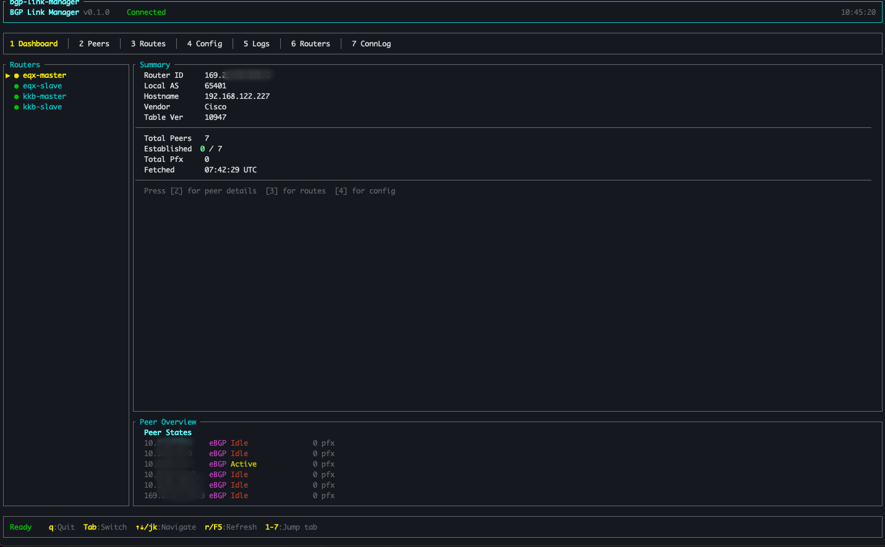

# bgp-link-manager

> A terminal UI (TUI) for monitoring and managing BGP sessions across multi-vendor routers — live over SSH, encrypted credentials, real-time state — all inside your terminal.



---

## Features

- Live BGP peer state for every router on a single screen
- Neighbor wizard — create, edit, delete BGP neighbors with vendor-specific CLI generation
- Route-map, prefix-list, and community-list editors
- Full BGP RIB navigation without leaving the TUI
- Config history with rollback support
- Peer state alerting and transition timeline
- Ping monitor with RTT, packet loss, and sparkline
- Per-tab search/filter across all views
- Encrypted credential storage (AES-256-GCM, Argon2id key derivation)
- SSH via system OpenSSH with ControlMaster multiplexing

**Supported routers:** Cisco IOS / IOS-XE · VyOS 1.5 (FRRouting) · Citrix VPX · pfSense · FortiGate (with VDOM)

---

## Install

### Homebrew (macOS & Linux)

```bash
brew install rammses/tap/bgp-link-manager
```

### Download binary

Pre-built binaries for macOS (ARM + Intel), Linux (ARM + x64), and Windows x64 are available on the [Releases](https://github.com/rammses/bgp-display/releases) page.

### Build from source

**Prerequisites:** Rust 1.75+, OpenSSH client on `$PATH`, a 256-colour terminal.

```bash
git clone https://github.com/rammses/bgp-display.git
cd bgp-display
cargo build --release
# binary: target/release/bgp-link-manager
```

---

## First launch

```bash
bgp-link-manager
```

You will be prompted for an **encryption passphrase**. This protects the router credential database:

```
~/Library/Application Support/bgp-link-manager/routers.db   # macOS
~/.local/share/bgp-link-manager/routers.db                   # Linux
```

> The passphrase is never stored — enter it each time you launch.

After unlocking, press **`6`** to open the **Routers** tab and add your first router. See [HELP.md](HELP.md) for a full walkthrough of every tab and shortcut.

---

## Quick reference

| Key | Action |
|-----|--------|
| `q` / `Ctrl-C` | Quit |
| `Tab` / `Shift-Tab` | Next / previous tab |
| `1`–`7` | Jump to tab |
| `↑`/`↓` or `j`/`k` | Navigate |
| `r` / `F5` | Refresh |
| `p` | Projects popup |
| `?` | Keyboard shortcut help overlay |
| `/` | Filter (Peers, Routes, Config, Logs, SSH Log) |

---

## Tabs

| # | Tab | Purpose |
|---|-----|---------|
| 1 | Dashboard | Router list + BGP summary + peer state sparkline |
| 2 | Peers | Neighbor table, per-peer routes, MTU probe |
| 3 | Routes | Full BGP RIB |
| 4 | Config | Live config, route-map detail, policy editors |
| 5 | BGP Log | Application event log |
| 6 | Routers | Add / edit / delete routers |
| 7 | SSH Log | Connectivity events + ping monitor |

---

## Vendor support

| Vendor | SSH method | Status |
|--------|-----------|--------|
| Cisco IOS / IOS-XE | Direct shell | Full |
| VyOS 1.5 (FRRouting) | `vtysh` wrapper | Full |
| Citrix VPX | Shell pipe | Full |
| pfSense | Piped stdin | Full |
| FortiGate | Piped stdin + VDOM | Full |

---

## Diagnostics

Logs are written to a daily-rotating file (never to the terminal):

```
~/Library/Application Support/bgp-link-manager/logs/   # macOS
~/.local/share/bgp-link-manager/logs/                    # Linux
```

Control verbosity with `BGP_LM_LOG`:

```bash
BGP_LM_LOG=debug bgp-link-manager   # SSH commands, fetch requests
BGP_LM_LOG=trace bgp-link-manager   # per-frame draw timing
```

---

## Project layout

```
src/
├── main.rs              Entry point + passphrase prompt
├── tui.rs               Terminal setup / event loop
├── events.rs            AppEvent + FetchRequest enums
├── app.rs               Application state + key handler
├── config.rs            Config loading
├── db.rs                Encrypted SQLite (AES-256-GCM)
├── ssh.rs               SshSessionManager (ControlMaster pool)
├── fetch.rs             Background data fetch service
├── export.rs            JSON export/import
├── bgp/
│   ├── mod.rs           BGP types + parsers
│   └── naming.rs        Policy naming conventions
├── router/
│   ├── mod.rs           RouterBackend enum dispatch
│   ├── cisco.rs         Cisco IOS/IOS-XE
│   ├── vyos.rs          VyOS (FRRouting)
│   ├── citrix.rs        Citrix VPX
│   ├── pfsense.rs       pfSense
│   ├── fortigate.rs     FortiGate (VDOM)
│   └── commands.rs      Vendor-specific CLI generation
└── ui/
    ├── mod.rs            Layout, colour palette, overlays
    ├── dashboard.rs      Tab 1
    ├── peers.rs          Tab 2
    ├── routes.rs         Tab 3
    ├── config_tab.rs     Tab 4
    ├── logs.rs           Tab 5
    ├── router_editor.rs  Tab 6
    ├── conn_log.rs       Tab 7 + ping monitor
    ├── neighbor_wizard.rs
    ├── routemap_editor.rs
    ├── prefixlist_editor.rs
    ├── communitylist_editor.rs
    ├── project_popup.rs
    └── help_overlay.rs
```

---

## Contributing

Contributions welcome — bug fixes, new vendor backends, parser improvements.

```bash
git clone https://github.com/rammses/bgp-display.git
cd bgp-display
cargo build && cargo clippy -- -D warnings
```

See [AGENTS.md](AGENTS.md) for architecture details and the vendor backend guide.

---

## License

MIT
