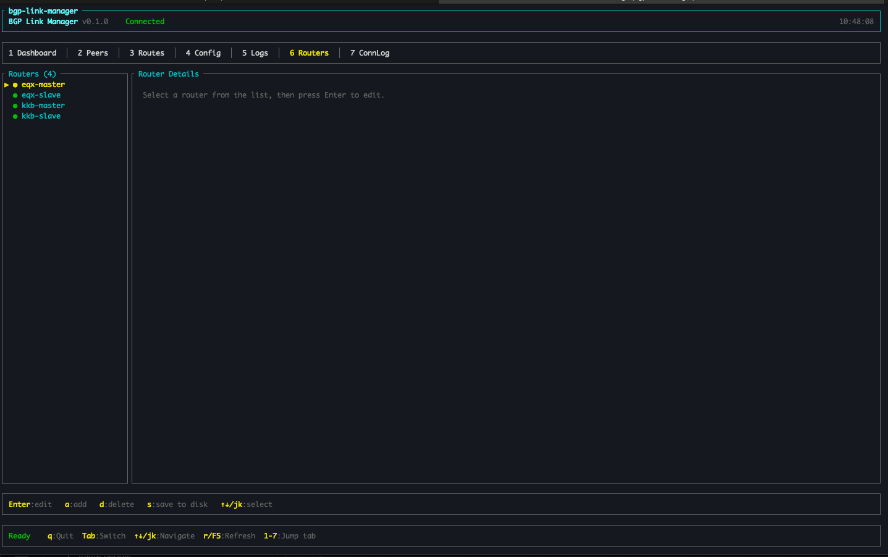
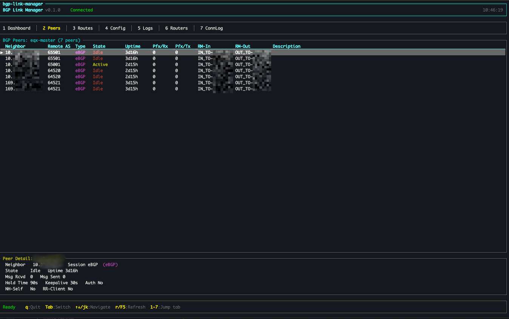
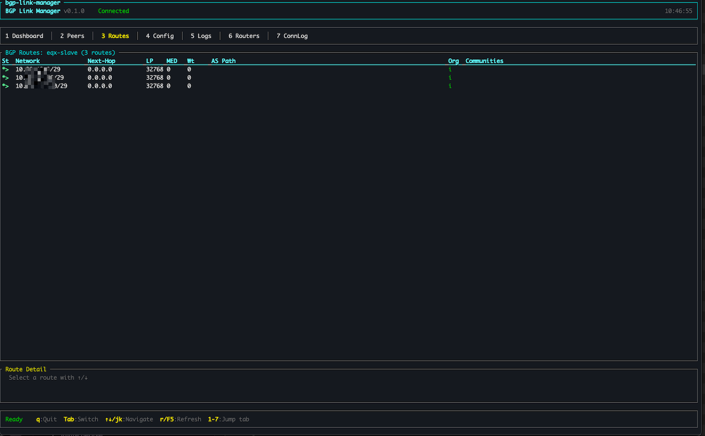
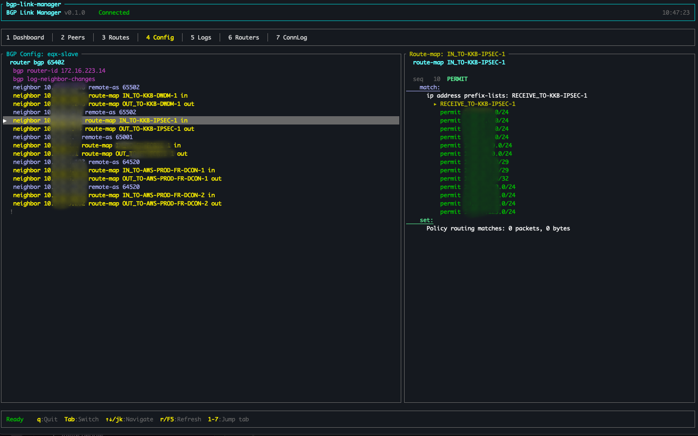
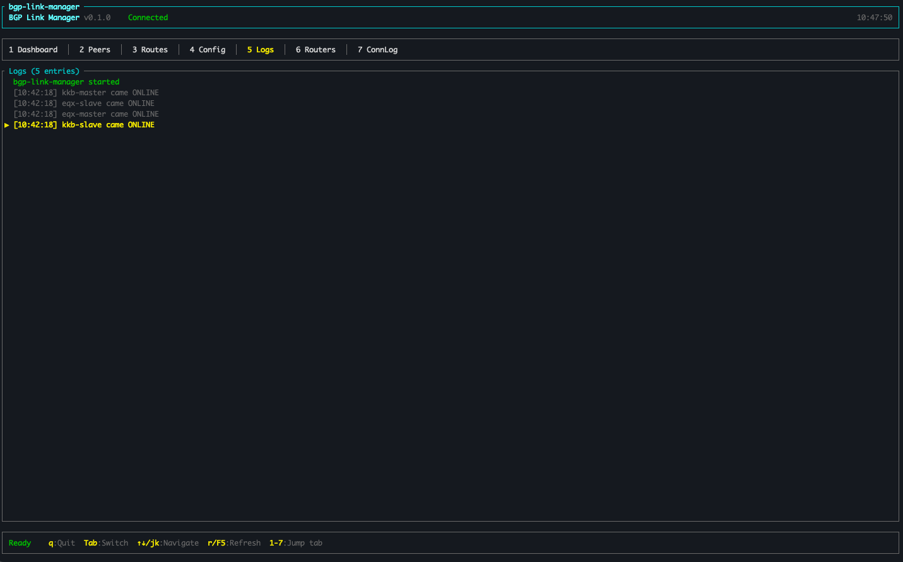
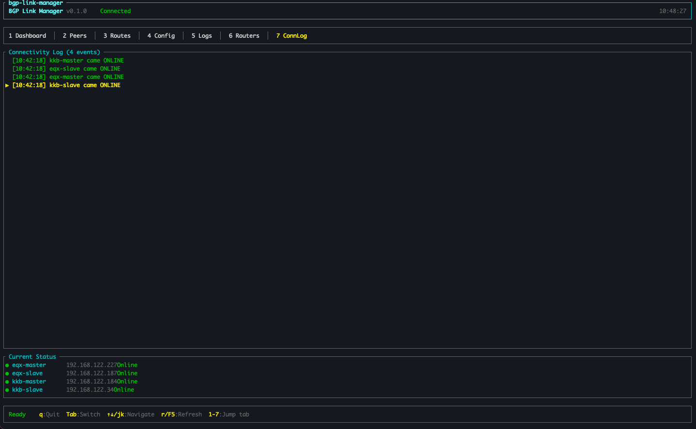

# bgp-link-manager

> A terminal UI (TUI) for monitoring and managing BGP sessions on production routers — live over SSH, encrypted credentials, real-time state — all inside your terminal.


---

## Goal

Network engineers spend a lot of time SSHing into routers, running `show ip bgp summary`, grepping through neighbour tables and cross-referencing route-maps with prefix-lists by hand.  
**bgp-link-manager** puts all of that in one place:

- Live BGP peer state for every router on a single screen
- Navigate the full BGP RIB without leaving the TUI
- Inspect route-maps with their prefix-list and community-list entries expanded inline — no more tabbing between `show route-map` and `show ip prefix-list`
- Add / edit / remove routers from inside the app; credentials are stored AES-256-GCM encrypted on disk
- Connectivity log tracks every TCP reachability change over time

**Supported routers:** Cisco IOS / IOS-XE · VyOS 1.5 (Circinus / FRRouting)  
**Planned:** Juniper JunOS, FortiGate FortiOS

---

## Install

### Prerequisites

| Requirement | Notes |
|-------------|-------|
| Rust 1.75 + | `curl https://sh.rustup.rs -sSf \| sh` |
| OpenSSH client | must be on `$PATH` — standard on macOS & Linux |
| A terminal that supports 256 colours | iTerm2, kitty, Alacritty, GNOME Terminal … |

### Build from source

```bash
git clone https://github.com/yourname/bgp-link-manager
cd bgp-link-manager
cargo build --release
# binary lands at target/release/bgp-link-manager
```

Copy to somewhere on your `$PATH`:

```bash
sudo cp target/release/bgp-link-manager /usr/local/bin/bgp-lm
```

---

## First Use

```bash
bgp-lm          # or: cargo run
```

On first launch you are prompted for an **encryption passphrase**.  
This passphrase protects the router credential database stored at:

```
~/Library/Application Support/bgp-link-manager/routers.db   # macOS
~/.local/share/bgp-link-manager/routers.db                   # Linux
```

> Passwords are encrypted with AES-256-GCM, key derived with Argon2id.  
> The passphrase is never stored — you must enter it each time you launch the app.

After unlocking, press **`6`** to open the **Routers** tab and add your first router:



Fill in hostname, SSH port, username, password, local AS number, and **vendor** (Cisco or VyOs).  
The router is saved immediately to the encrypted database.

> **Vendor field:** press `Space` while the Vendor row is active to toggle between `Cisco` and `VyOs`.

---

## Operate

Use number keys `1`–`7` to jump between tabs, or `Tab` / `Shift-Tab` to cycle.

### 1 · Dashboard


- Left column: router list with live TCP ping indicator (● green = reachable, ● red = unreachable)
- Right panel: BGP summary for the selected router — peer count, total prefixes, uptime

### 2 · Peers



BGP neighbour table with:

| Column | Description |
|--------|-------------|
| Neighbor | Peer IP address |
| AS | Remote ASN |
| State | Established / Active / Idle … (colour-coded) |
| Uptime | Session uptime |
| Pfx Rcvd | Prefixes received |
| RM-In / RM-Out | Applied inbound / outbound route-maps |

Select a row and press `Enter` for the per-peer detail pane.

### 3 · Routes



Full BGP RIB — network, next-hop, local-pref, MED, weight, AS-path, origin, communities.  
`↑` / `↓` to navigate rows; `r` to refresh.

### 4 · Config



Left panel shows the live BGP configuration as a navigable menu.  
Navigate with `↑` / `↓`. When the cursor lands on a **route-map** line the right panel expands it inline — every `seq` entry, its `match` prefix-lists and community-lists with individual rows, and all `set` clauses — no extra SSH commands needed.

### 5 · Logs



In-memory event log: SSH errors, parser warnings, config pushes.

### 6 · Routers


Add, edit and delete routers. Each router has a **Vendor** field — press `Space` on that row to toggle between `Cisco` (IOS / IOS-XE) and `VyOs` (VyOS 1.5 / FRRouting). Changes persist immediately to the encrypted database.

| Vendor | SSH target | BGP commands |
|--------|-----------|---------------|
| `Cisco` | IOS / IOS-XE shell | `show ip bgp summary`, `show ip bgp neighbors …` |
| `VyOs`  | VyOS restricted shell → `vtysh` | `show bgp ipv4 unicast summary`, `show bgp neighbors …` |

### 7 · Connectivity Log



Timestamped history of every TCP reachability change for every router.

### Key bindings

| Key | Action |
|-----|--------|
| `q` / `Ctrl-C` | Quit |
| `Tab` / `Shift-Tab` | Next / previous tab |
| `1` – `7` | Jump directly to tab |
| `↑` / `k`, `↓` / `j` | Navigate rows |
| `r` / `F5` | Refresh selected router |
| `a` | Add router (Routers tab) |
| `e` | Edit selected router (Routers tab) |
| `d` | Delete selected router (Routers tab) |
| `Enter` | Confirm / open detail |
| `Esc` | Cancel / close detail |
| `Space` | Cycle Vendor field (Routers tab, Vendor row) |

---

## Contribute

Contributions are welcome — bug fixes, new vendor backends, parser improvements, UI polish.

```bash
# Fork & clone
git clone https://github.com/yourname/bgp-link-manager
cd bgp-link-manager

# Create a feature branch
git checkout -b feature/juniper-backend

# Build + check
cargo build
cargo clippy -- -D warnings

# Run
cargo run
```

### Adding a new vendor backend

Follow the same pattern as `src/router/vyos.rs` (VyOS) or `src/router/cisco.rs`:

1. Create `src/router/<vendor>.rs` with a backend struct implementing:

```rust
pub async fn connect(&mut self)    -> Result<()>
pub async fn disconnect(&mut self) -> Result<()>
pub async fn refresh(&mut self)    -> Result<BgpSummary>
pub async fn get_routes(&mut self) -> Result<Vec<BgpRoute>>
pub async fn fetch_route_map_detail(&self, name: &str) -> Result<RouteMapDetail>
pub async fn apply_config(&mut self, config: &str) -> Result<()>
```

2. Add `pub mod <vendor>;` and a `RouterBackend::<Vendor>(…)` variant in `src/router/mod.rs`, with dispatch arms for every method.
3. Add a `RouterVendor::<Vendor>` variant in the same file and handle it in `Display`.
4. Handle `"<vendor>"` in `db.rs` `load_all()` and in `app.rs` `spawn_bgp_fetch_for` / `spawn_routemap_fetch`.
5. Handle field index 5 (Vendor) in `apply_buf_to_draft` in `app.rs`.

### Project layout

```
src/
├── main.rs            Entry point + passphrase prompt
├── tui.rs             Terminal setup / event loop
├── events.rs          AppEvent enum
├── app.rs             Application state + key handler
├── config.rs          Config loading (uses RouterDb)
├── db.rs              AES-256-GCM encrypted SQLite credential store
├── bgp/
│   └── mod.rs         BGP types + FRR/Cisco output parsers
├── router/
│   ├── mod.rs         RouterBackend enum + RouterVendor dispatch
│   ├── cisco.rs       Cisco IOS / IOS-XE SSH backend
│   └── vyos.rs        VyOS 1.5 SSH backend (vtysh wrapper)
└── ui/
    ├── mod.rs          Layout, tab bar, colour palette
    ├── dashboard.rs    Tab 1
    ├── peers.rs        Tab 2
    ├── routes.rs       Tab 3
    ├── config_tab.rs   Tab 4 — navigable config + route-map detail
    ├── logs.rs         Tab 5
    ├── router_editor.rs Tab 6
    └── conn_log.rs     Tab 7
```

Please open a GitHub issue before starting large refactors so we can align on direction.

---

## Buy me a coffee

If this tool saves you time on your network shifts, a small tip is always appreciated ☕

**Payoneer:** [payoneer.com/pay](https://www.payoneer.com/pay)  
mesutbayrak at gmail dot com

---

## License

MIT

